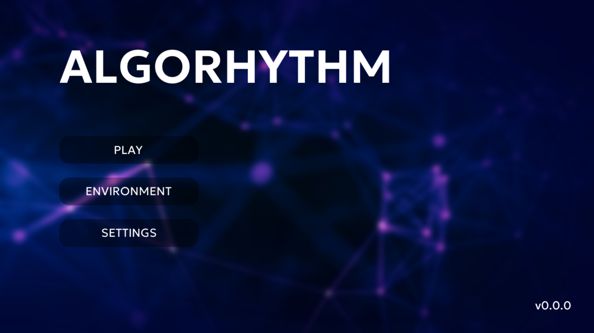

<h1 align="center"> ALGORHYTHM </h1>

 A keyboard-based rhythm game made in pygame! 

 

  <table>
    <tr>
      
    </tr>
  </table>

---

Lose yourself in rhythmic delight as you jackhammer the keyboard to the beat!

Why have the lanes and keys be static? *Algorhythm* takes a spin on traditional lane-based keyboard rhythm games, with shifting lanes and changing keys to unlock an intense and dynamic new experience.

### Features
 - 6 unique note kinds to discover
 - ? songs, including ? original tracks
 - Up to 4 charts with different difficulty levels for each track
 - ? meticulously hand-crafted charts (with more being added!)

### Upcoming Features
- *Freestyle*
- *Branchout*
- Chart editor (!?)

 

## Installation

Availble for download as an .exe file.

Alternatively, download the source code and execute it yourself!

### Dependencies
- [Pygame 2.5](https://www.pygame.org)
- [Pillow]()
- [Librosa x.y]()

### Requirements
QWERTY keyboard recommended. Mouse or touch required for navigation (keyboard navigation support is in development).

The following keys are used in charts:
 - A–Z letters
 - 4 arrow keys
 - Space bar
 - Enter key

 

## Credits

This was entirely a solo project, with the intention of challenging myself to finally create a proper, finished game!

### Game
- Much inspired by [*Phigros*](https://phigros.fandom.com/wiki/Phigros_Wiki), as well as various other rhythm games ([*Ryceam*](https://ryceam.fandom.com/wiki/Ryceam_Wiki), [*rote2*](https://store.steampowered.com/app/1735670/roteroteSquare)).

### Code
- Coded entirely by yours truly, from scratch.
- Made in [Python 3.11](https://www.python.org) with [Pygame 2.5](https://www.pygame.org).

### Assets
- Cover art for some tracks were generated using [DALL-E 3](https://openai.com/dall-e-3).

### Fonts
- [Geologica](https://fonts.google.com/specimen/Geologica) (available on Google Fonts)

### Sounds
- Only the tracks in the *Xenos* series are by other artists.
- All other soundtracks and sound effects were created by yours truly, in [GarageBand](https://www.apple.com/ios/garageband) (iPadOS).

 

## Charts

In the unlikely scenario that you would like to create a chart... it is not easy, but would be hugely appreciated. See [charting](docs/charting.md).
